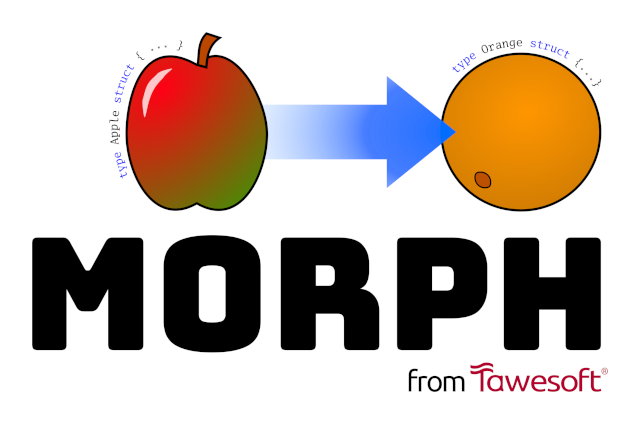

[](https://github.com/tawesoft/morph)

# Apples to Oranges: mapping between Go structs with Morph

Take the source code for an example struct, Apple, which uses custom-made
weight and price packages.

```go
type Apple struct {
    Picked    time.Time
    LastEaten time.Time
    Weight    weight.Weight
    Price     price.Price
}
```

Let's say we want a new struct, similar to this, but where every field is an
integer, to make it easier to serialise and interoperate with other systems.

We're going to call it an Orange.

> **Note:** for clarity, going forward we'll be precise and call `type T 
> struct` a struct type definition, `T` a struct type, `var t T` a struct 
> value definition, and `t` a struct value.


## Parsing a struct type definition from source code

First, we need to tell morph about the struct type definition.

Using [morph.ParseStruct] we can extract this from a string literal or
parse a file for a struct by name:

```go
apple, err := morph.ParseStruct("apple.go", nil, "Apple")
```

> **Example code:** [morph.ParseStruct (from string) example]

> **Example code:** [morph.ParseStruct (from file) example]

Morph doesn't need to fully resolve identifiers like the `weight.Weight` and 
`price.Price` types of the Weight and Price fields, so we don't need to tell 
morph anything about them or parse any additional definitions.

For our own understanding, let's assume these packages look something
like this:

```go
package weight

type Weight struct { /* ... */ }
func (w Weight) Grams() int64 { /* ... */ }
func FromGrams(grams int64) Weight { /* ... */ }
```

```go
package price

type Price struct { /* ... */ }
func (p Price) Pence() int64 { /* ... */ }
func FromPence(pennies int64) Price { /* ... */ }
```

Again, these definitions are just for us, and don't need to be written down
anywhere.

> **Tip:** morph doesn't need full type information. It is the Go compiler that 
> ensures morph generates correct code.
 
[morph.ParseStruct]: https://pkg.go.dev/github.com/tawesoft/morph#ParseStruct
[morph.ParseStruct (from string) example]: https://pkg.go.dev/github.com/tawesoft/morph#example-ParseStruct-FromString
[morph.ParseStruct (from file) example]: https://pkg.go.dev/github.com/tawesoft/morph#example-ParseStruct-FromFile


## Mapping to a new struct type definition

There are two ways morph can change our parsed Apple struct type definition 
into our desired Orange struct type definition. We can also combine the two.

* Using a [morph.StructMapper] and the [morph.Struct.Map] method.
* Using a [morph.FieldMapper] and the [morph.Struct.MapFields] method.

A field mapper is easier to write, but less powerful.

### Using a StructMapper to rename a struct type

A StructMapper is a function that takes a copy of a struct as input, and 
outputs a new struct.

The [structmappers package] contains useful things for working with
StructMappers, like the [structmappers.Rename] function that returns a 
new StructMapper that sets a struct's name to the provided argument.

```go
orange := apple.Map(structmappers.Rename("Orange"))
```

> **Example code:** [structmappers.Rename example]

> **Tip:** You might think that it's simpler just to set the Name field on the
> `morph.Struct` directly, but we should always prefer to use a StructMapper. 
> The reason why will become clear soon.

We've taken the first step in morphing our Apple. By printing the resulting
mapped struct, we can generate some source code for a new
struct type definition:

```go
fmt.Println(orange)
```

So far, this prints the following string:

```go
type Orange struct {
    Picked    time.Time
    LastEaten time.Time
    Weight    weight.Weight
    Price     price.Price
}
```

Next, we need to work on the fields.

[structmappers.Rename example]: https://pkg.go.dev/github.com/tawesoft/morph/structmappers#example-Rename


### Using a FieldMapper to change a struct type's fields

A FieldMapper is a function that is called on every field on an input struct, 
and generates output fields on an output struct.

For our Apple, that means a FieldMapper will be called once each for the fields
`Picked`, `LastEaten`, `Weight`, and `Price`.

The [fieldmappers package] contains useful things for working with 
FieldMappers, like the FieldMapper implementation [fieldmappers.TimeToInt64]
which suits our purposes.

This, as its name suggests, maps `time.Time` fields to `int64` values. Other
fields are left unchanged, and output normally.

FieldMappers are applied through the [morph.Struct.MapFields] method.

```go
orange = orange.MapFields(fieldmappers.TimeToInt64)
```

> **Example code:** [fieldmappers.TimeToInt64 example]

FieldMappers are often general purpose enough that they can be reused and 
combined in different situations.

So far we've mapped the first two fields of our struct type definition.
Printing the result generates the following string of source code:

```go
type Orange struct {
    Picked    int64 // time in seconds since Unix epoch
    LastEaten int64 // time in seconds since Unix epoch
    Weight    weight.Weight
    Price     price.Price
}
```

If you'll notice, `fieldmappers.TimeToInt64` automatically set a nice comment 
for us too.

We still want to map our `Weight` and `Price` fields, so it's time to make
our own FieldMappers.

[fieldmappers.TimeToInt64 example]: https://pkg.go.dev/github.com/tawesoft/morph/fieldmappers#example-TimeToInt64


### Creating a custom FieldMapper

A FieldMapper has the following signature:

```go
type morph.FieldMapper func(input morph.Field, emit func(output morph.Field))
```

The `input` argument lets us discriminate what fields we want our mapper to 
apply to. The `emit` function controls what fields are generated on the output.
If we don't emit the field, that field is removed. If we emit more than once,
we can emit multiple fields per input field.

The simplest FieldMapper is one that does nothing but emit the input
unchanged:

```go
func Passthrough(input morph.Field, emit func(output morph.Field)) {
    emit(input)
}
```

Let's implement our FieldMapper for weight and price separately, and let's
discriminate on field type, rather than name, so that it's more
general-purpose and reusable. We'll see another reason why we have separate 
price and weight implementations, later.

```go
func WeightToInt64(input morph.Field, emit func(output morph.Field)) {
    if input.Type == "weight.Weight" {
        output: = input // copy
        output.Type = "int64" // rewrite the type
        emit(output)
    } else {
        emit(input)
    }
}
```

> **Tip:** it is always safe to copy or modify the input argument inside a 
> StructMapper or a field mapper.

> **Practice:** what would a FieldMapper for the Price field look like?

We'll add more to this later, but it's enough for generating a struct
type definition for our Orange.

> **Example** [morph.FieldMapper example]

Now, by composing multiple StructMappers and FieldMappers we get our Orange:

```go
orange := apple.Map(
    structmappers.Rename("orange"),
).MapFields(
    fieldmappers.TimeToInt64,
    WeightToInt64,
    PriceToInt64, //  left as exercise for reader
)
fmt.Println(ornage)
```

This generates:

```go
type Orange struct {
    Picked    int64 // time in seconds since Unix epoch
    LastEaten int64 // time in seconds since Unix epoch
    Weight    int64
    Price     int64
}
```

> **Tip:** that's a Go source code fragment - we can write that string to a 
> file and get an automatically generated struct type definition.
> 
> If we re-run that process every time the struct type definition for Apple 
> changes, then the struct type definition for Orange will also update 
> appropriately.

[morph.FieldMapper example]: https://pkg.go.dev/github.com/tawesoft/morph#example-FieldMapper


## Generating struct value conversion functions

> **Tip:** 
> You don't have to have used morph to generate a struct type definition to get
> value out of this section. It's still useful if you want to learn how to use 
> morph to create conversion functions for your existing struct
> types.

We've now got a full definition for our new Orange struct type, automatically
derived from our starting Apple type.

```go
type Orange struct {
    Picked    int64 // time in seconds since Unix epoch
    LastEaten int64 // time in seconds since Unix epoch
    Weight    int64
    Price     int64
}
```

That's struct type definitions. What about when we use Apple or Orange 
struct values?

Let's say we have an apple value in our source code:

```go
apple := Apple{
    Picked: time.Parse(time.DateTime, "2023-05-29 09:00:00"")
    // LastEaten: zero value
    Weight: weight.FromString("50 kg")
    Price: price.FromString("£1.23")
}
```

We want to be able to convert to an orange, and back, like so:

```go
orange := apple.ToOrange()
appleAgain := orange.ToApple()
appleAgain == orange // true
```

> **Tip:** if you don't like these as methods, Morph can just as easily 
> generate functions in the form `AppleToOrange(input Apple) Orange`.

This is achieved through the [morph.Struct.Converter] method, which generates
source code for a function that converts a struct value based on the same
StructMapper and FieldMapper applications we've seen before.

The generated function matches a supplied function signature, which is
quite flexible. The function signature must have at least one argument or 
receiver value of the source type (here, Apple), and exactly one return 
value of the result type (here, Orange). Pointer values are fine, too.

```go
const converterSignature := "(apple Apple) ToOrange() Orange"
```

We can actually use a shortcut here, and use `$from`, `$From` and `$To`
tokens to fill in some of the function signature for us, like so:

```go
const converterSignature = "($from $From) To$To() $To"
```

And then let morph generate the function for us:

```go
appleToOrange, err := orange.Converter(converterSignature)
fmt.Println(appleToOrange)
```

This generates an output like so:

```go
// ToOrange converts [Apple] to [Orange].
func (apple Apple) ToOrange() Orange {
	return Orange{
		Picked:    apple.Picked.UTC().Unix(),
		LastEaten: apple.LastEaten.UTC().Unix(),
		// Weight is the zero value.
		// Price is the zero value.
	}
}
```

Notice that a helpful doc comment was automatically generated for us
at the start of the function, too.

Note that the Weight and Price fields haven't been updated, and are left
at the zero value.

This is because when we created a FieldMapper for weights and prices, we
defined how to map field types, but not field values.

We have to go back to our custom FieldMapper implementation and add a Value 
expression to the emitted field.

```go
func WeightToInt64(input morph.Field, emit func(output morph.Field)) {
    if input.Type == "weight.Weight" {
        output: = input // copy
        output.Type = "int64" // rewrite the type
        output.Value = "$.$.Grams()" // rewrite the value
        emit(output)
    } else {
        emit(input)
    }
}
```

Here we see `$` tokens again. In a FieldMapper, they have the following 
meanings when they appear in a `morph.Field.Value`:

| Token | Description                              | Example                                       |
|-------|------------------------------------------|-----------------------------------------------|
| `$.`  | Input struct name                        | `$.LastEaten` replaced with `apple.LastEaten` |
| `$.$` | Input struct name and current field name | `$.$` replaced with `apple.Weight`            |

This is enough to generate the forward mapping, `Apple` to `Orange`. Again,
the Price mapping has been left as an exercise.

> **Example:** [morph.Struct.Converter example]

```go
func (apple Apple) ToOrange() Orange {
	return Orange{
		Picked:    apple.Picked.UTC().Unix(),
		LastEaten: apple.LastEaten.UTC().Unix(),
		Weight:    apple.Weight.Grams(),
		Price:     apple.Price.Pence()
	}
}
```

But what about the reverse, `ToApple`?

[morph.Struct.Converter example]: https://pkg.go.dev/github.com/tawesoft/morph#example-Struct.Converter


### Generating a reverse struct value conversion function

This is where some magic happens.

We want to generate a function, `func (orange Orange) ToApple() Apple`,
that maps Orange struct values back into Apple struct values.

We could do this by reversing our steps, and applying StructMappers and 
FieldMappers in reverse order to undo the changes we've made.

That would be a bit awkward, however, because all the fields on our Orange
are now of type `int64` and it's difficult to discriminate between them.

Fortunately, many StructMappers and FieldMappers are reversible, so we can
have morph do this for us!

```go
appleFromOrange := orange.Map(structmappers.Reverse) // magic!!!
```

> **Tip:** the const `converterSignature` template string from the 
> previous section came in handy! Thanks to the token replacement, we didn't 
> have to specify a function signature again.

But before we do this, let's go back to our custom FieldMapper one last time,
and add the finishing touches to make it reversible too.

A reverse function is simple to write. It is just a FieldMapper, but as it is 
only called on a field that has explicitly set it as its reverse function, 
it does not need to discriminate on name or type. The original mapper then 
registers the Reverse function on the emitted field.

So, we need to update our FieldMapper to set the Reverse function on the
emitted field. For good measure, we can set the Comment, too.

When we set the Reverse function on a field, we compose it with the field's 
existing reverse function. This means that even if we've applied several 
transformations to a field, we can still reverse them all in order.

> **Tip:** if a mapping is not reversible, set the Reverse function to nil.

This makes our full custom mapper for the weight field look as follows:

```go
func WeightToInt64(input morph.Field, emit func(output morph.Field)) {
    reverse := func(input morph.Field, emit func(output morph.Field)) {
        output := input
        output.Type = "weight.Weight"
        output.Value = "weight.FromGrams($.$)"
        output.Comment = ""
        emit(output)
    }

    if input.Type == "weight.Weight" {
        output := input // copy
        output.Type = "int64" // rewrite the type
        output.Value = "$.$.Grams()" // rewrite the value
        output.Reverse = fieldmappers.Compose(reverse, output.Reverse)
        output.Comment = "weight in grams"
        emit(output)
    } else {
        emit(input)
    }
}
```

So finally:

```go
appleFromOrange := orange.Map(structmappers.Reverse)
orangeToApple, err := appleFromOrange.Converter(converterSignature)
fmt.Println(orangeToApple)
```

This outputs generated source code for a function that converts
struct values of type Orange back to struct values of type Apple:

```go
// ToApple converts [Orange] to [Apple].
func (orange Orange) ToApple() Apple {
	return Apple{
		Picked:    time.Unix(orange.Picked, 0).UTC(),
		LastEaten: time.Unix(orange.LastEaten, 0).UTC(),
		Weight:    weight.FromGrams(orange.Weight),
		Price:     price.FromPence(orange.Price),
	}
}
```

> **Example:** [morph.Struct.Converter reverse example]
 

[morph.Struct.Converter reverse example]: https://pkg.go.dev/github.com/tawesoft/morph#example-Struct.Converter-Reverse


[morph.StructMapper]: https://pkg.go.dev/github.com/tawesoft/morph#StructMapper
[morph.FieldMapper]: https://pkg.go.dev/github.com/tawesoft/morph#FieldMapper
[morph.Struct.Map]: https://pkg.go.dev/github.com/tawesoft/morph#Struct.Map
[morph.Struct.MapFields]: https://pkg.go.dev/github.com/tawesoft/morph#Struct.MapFields
[morph.Struct.Converter]: https://pkg.go.dev/github.com/tawesoft/morph#Struct.Converter
[structmappers package]: https://pkg.go.dev/github.com/tawesoft/morph/structmappers
[structmappers.Rename]: https://pkg.go.dev/github.com/tawesoft/morph/structmappers#Rename
[fieldmappers package]: https://pkg.go.dev/github.com/tawesoft/morph/fieldmappers
[fieldmappers.TimeToInt64]: https://pkg.go.dev/github.com/tawesoft/morph/fieldmappers#TimeToInt64
